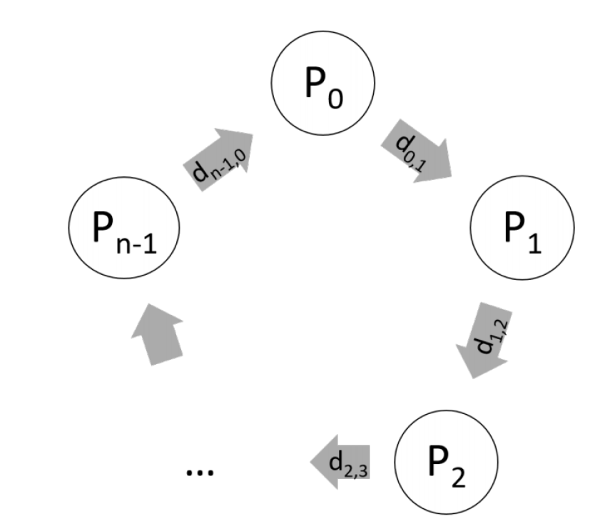

# Leader-Election-Problem
 
 
    

 
  

  
Consider a cycle of computational nodes distributed in an IP-based network like the figure above. As the input to your program, in the first line, you will be given a positive integer storable in at most 16-bit unsigned integer in the standard format. This would indicate the number of nodes in the network, n. After that, you need to read n consecutive lines of floating-point numbers given in the standard format. These numbers indicate the delay between the nodes on the cycle from the first one to the last.
Generate a random positive integer unique ID (UID) for each node that we will be calling the <node-id>. Please note that the nodes do not know the value of n. The only information available to them is the upper bound that we gave you.
Write a node class having the attributes needed to describe a node in our system. Please note that we would be sending the messages on real sockets on the localhost machine, so you probably need to assign a port number to each of the nodes.
Add functions to your node class to support the unique ID generation and also sending, receiving, and processing. So, each of the nodes may have three concurrent actions:
Receive a packet from a node in the system, analyze its information, and store it in a queue accessible to the processing unit.
Prepare and send packets from the node if there is any message available in the send queue which is accessible to the processing unit.
A processing unit that at first the node is started, initiates the parameters, starts the connections, and the send and receive threads. Then it will send a message indicating its unique ID, given the format in the next part (actually it should only prepare the message and put it inside the queue). It may receive packets in the queue, which it should analyze.
The messages are sent over TCP-IP with a JSON format like below:
{
“source”: <sender’s node’s unique ID>,
“type”: <type of the message>,
“value”: <the suggested value>
}
Implement the LCR algorithm for leader election:
Initially, each process in the ring is marked as a non-participant.
A node that notices a lack of a leader starts an election. It creates an election message containing its unique ID. It then sends this message clockwise to its neighbor. Use the messaging format in part 4 by type of “election-message”, and the value of its unique ID. Please note that all of the nodes do not have to be already connected and initiated before starting this phase! How? You may implement it in a synchronous manner too and make sure everything is set up before you start.
Every time a node sends or forwards an election message, the process also marks itself as a participant (so we need a status attribute for each node to show if it is participating, decided, leader, or offline).
When a node receives an election message it compares the unique ID in the message with its own.
If the UID in the election message is larger, the process unconditionally forwards the election message in a clockwise direction.
If the UID in the election message is smaller, and the process is not yet a participant, the process replaces the UID in the message with its own UID, sends the updated election message in a clockwise direction.
If the UID in the election message is smaller, and the process is already a participant (i.e., the process has already sent out an election message with a UID at least as large as its own UID), the process discards the election message.
If the UID in the incoming election message is the same as the UID of the process, that process starts acting as the leader.
When a process starts acting as the leader, it begins the second stage of the algorithm.
The leader node marks its state as the leader and sends an “elected” type message to its neighbor announcing its election and UID.
When a node receives an “elected” type message, it marks itself as a decided, records the elected UID, and forwards the elected message unchanged.
When the elected message reaches the newly elected leader, the leader discards that message, and the election is over.
Log the communications inside a file. Also, print out the decisions made by each node. How would we know the algorithm is finished?
Give an intuition that why the algorithm works (terminates and gives the correct expected answer). What happens if we use UDP instead of TCP? What happens if the UIDs generated are not unique? Given your algorithm in part 1, can you calculate the chance of any two UIDs to be equal?

